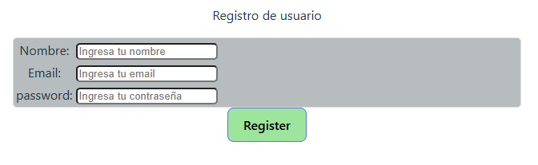

# API Search Interfaz de Usuarios 🔍

Aplicación creada con React- Vite + Context-Sett para registrar usuarios .

## 🌐 Demo en vivo

👉 [Haz clic aquí para ver la app funcionando](https://registro-de-usuarios-hooks-js.vercel.app/)

🧾 Registro de Usuario

Esta interfaz permite registrar un nuevo usuario mediante un formulario simple que solicita los siguientes campos:

Nombre

Email

Contraseña

Cuando el usuario hace clic en el botón "Register", se activa una función que:

Valida los datos ingresados (usansdo Context y sett).

Simula o realiza una petición a una API para registrar el usuario.

Muestra un mensaje de confirmación o alerta que indica si el registro fue exitoso
